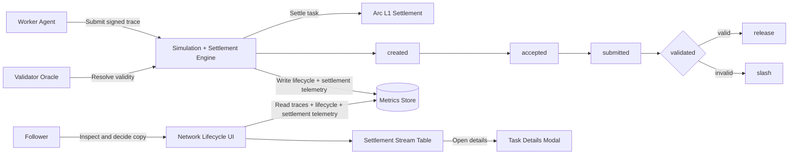

# arc-s3

## Architecture

### Container View

- Worker agents submit signed reasoning traces to the simulation and settlement engine.
- The validator oracle resolves validity for submitted traces.
- Settlements execute on Arc L1 with release/slash outcomes.
- Metrics store persists traces, lifecycle checkpoints, and settlement telemetry.
- The Next.js UI consumes telemetry for lifecycle visibility and task drill-down.

### Operational Lifecycle Flow

### Flow Key

- stage nodes: created, accepted, submitted, validated represent on-chain lifecycle checkpoints.
- valid -> release: validator accepted the trace and settlement releases funds.
- invalid -> slash: validator rejected the trace and settlement applies slashing.
- table -> modal: operator opens task drill-down from settlement stream rows.

## Arc Testnet Setup

1. Fill `.env` from `.env.example` with Arc RPC/key/token values.
2. Deploy contracts:
   - `npm run deploy:arc -w @arc-s3/contracts`
3. Bootstrap firewall, validator roles, and identities:
   - `npm run bootstrap:arc -w @arc-s3/contracts`
4. If needed, sync identities again:
   - `npm run register:identities:arc -w @arc-s3/contracts`

## Circle Agent Wallet Integration

This repository now includes Circle agent-wallet support for setup, funding,
spending-policy checks, service discovery/pay, and Arc identity syncing.

### Circle session note (testnet)

- Circle sessions are environment-scoped. If you switch between mainnet and testnet,
  authenticate and verify wallet state in the target environment before running agents.
- For Arc testnet runs, re-check wallet limits and available balance using
  `npm run circle:status` and top up with `npm run circle:fund` as needed.

### Enable policy guardrails for agents

Set these in `.env`:

- `CIRCLE_POLICY_ENFORCE=true`
- `CIRCLE_WALLET_CHAIN=BASE`
- `CIRCLE_POLICY_REQUIRE_STATUS=true`
- `CIRCLE_POLICY_REQUIRE_LIMITS=true`
- optional thresholds: `CIRCLE_POLICY_MIN_PER_TX_USDC`, `CIRCLE_POLICY_MIN_DAILY_USDC`

When enabled, `rfb5` and `rfb6` processes verify Circle session + wallet limits
before running.

RFB5 can now optionally submit profitable opportunities on-chain through
`S3IntentFirewall -> S3EscrowCourthouse.forwardCreateTaskV2` by enabling:

- `RFB5_ONCHAIN_EXECUTE=true`

Safety controls for RFB5 on-chain execution:

- `RFB5_ONCHAIN_DRY_RUN`
- `RFB5_ONCHAIN_MAX_TASKS_PER_RUN`
- `RFB5_ONCHAIN_SIZE_SCALE`
- `RFB5_ONCHAIN_MIN_PAYMENT_USDC6`
- `RFB5_ONCHAIN_MAX_PAYMENT_USDC6`
- `RFB5_ONCHAIN_DAILY_NOTIONAL_CAP_USDC6`

### RFB5 on-chain live behavior notes

- Intent deadline default for RFB5 is `INTENT_DEFAULT_DEADLINE_SECONDS=600`.
- Market fetches use retry + timeout handling to reduce transient `ECONNRESET`/hang-up impact.
- The process keeps running through uncaught promise/network errors and logs them for review.
- Payment sizing is balance-aware: capped by configured max, spendable follower USDC,
  and minimum payment threshold.
- Common skip reasons now include `daily-notional-cap`,
  `insufficient-follower-usdc-balance`, and `payment-below-min`.

### Testnet cap profiles

- Safe smoke: `RFB5_ONCHAIN_DAILY_NOTIONAL_CAP_USDC6=2000000` (2 USDC/day)
- Live soak (recommended): `RFB5_ONCHAIN_DAILY_NOTIONAL_CAP_USDC6=100000000` (100 USDC/day)

### Circle operational commands

- Install skills + prep CLI: `npm run circle:setup`
- Inspect wallet/session/limits: `npm run circle:status`
- Fund wallet: `npm run circle:fund`
- Search paid services: `npm run circle:services:search`
- Inspect + pay service: `npm run circle:services:pay`

### Sync Circle wallet to Arc ERC-8004 identity

1. Set identity target in `.env`:
   - `CIRCLE_AGENT_ERC8004_ID=erc8004:arc:rfb5` (or another id)
2. Optionally pin wallet address:
   - `CIRCLE_AGENT_WALLET_ADDRESS=0x...`
3. Run sync:
   - `npm run circle:sync:identity`

The sync command reads the Circle agent wallet (or uses the forced address) and
registers it in `S3AgentIdentityRegistry` if the ERC-8004 id is not yet mapped.

## RFB5 Live Soak Runbook

1. Set live execution knobs in `.env.local`:
   - `RFB5_ONCHAIN_EXECUTE=true`
   - `RFB5_ONCHAIN_DRY_RUN=false`
   - `RFB5_ONCHAIN_DAILY_NOTIONAL_CAP_USDC6=100000000`
2. Run the process:
   - `npm run agent:rfb5 -w @arc-s3/rfb5-agent`
3. Follow executor output:
   - `tail -f simulation/data/agents/rfb5-sports-arb-executor.jsonl`
4. After a soak window, summarize outcomes:
   - `tail -n 400 simulation/data/agents/rfb5-sports-arb-executor.jsonl | rg '"status":"(submitted|skipped|error)"'`

To reset daily spend accounting during test loops, remove
`simulation/data/agents/rfb5-sports-arb-executor-state.json` and restart the agent.
