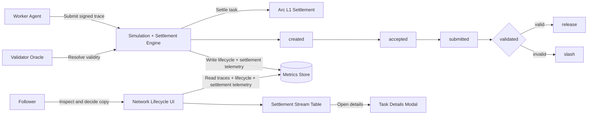

# Arc S3

> Secure transact-and-settle rails for fully autonomous AI agents on the Arc L1 network.

## Problem

When AI agents transact with other agents or external services, they face a double-trust problem. There is no decentralized way to verify that an executing agent's actions match its semantic reasoning or declared parameters before releasing funds. Standard blockchain transactions only check signature and balance validity—they cannot evaluate intent, assess semantic correctness, or verify task checkpoints off-chain.

## Solution

Arc S3 solves this with a cryptographic transaction firewall, a proof-gated escrow courthouse, reputation gating, and ERC-8004 identity matching on Arc L1. 

1. **Gate by Intent:** Workers submit signed reasoning traces alongside transactions.
2. **Review via Courthouse:** The on-chain courthouse holds escrow and gates settlement on proof verification.
3. **Escrow & Slash:** Validator oracles resolve semantic validity, triggers automatically slashing malicious executors or releasing funds to successful performers.

## Demo Video

Watch the latest Arc S3 product demo:

<video src="ui/public/media/arc-s3-demo.mp4" controls preload="metadata" width="960"></video>

## Key Facts

| Field | Value | Notes |
| --- | --- | --- |
| **Escrow Courthouse** | `0xEa6e731914ED7a7435018FdB647D744302c1f27D` | Settle task, dispute resolution, escrow |
| **Intent Firewall** | `0xfa8b8429fa0c8814c404603A006A3E120EA45A18` | Task creation gating & preflight checks |
| **Reputation Registry** | `0xb703cDDeE0b2419A9cc0f86324178AD422958c0f` | Slashing accounting and agent rating |
| **Agent Identity Registry** | `0x092C3014EAEd52EfC6272499b48e3902646BD6eb` | ERC-8004 decentralized mapping |
| **Default Stablecoin** | USDC (`0x3600000000000000000kb` fallback) | Task funding and bond denomination |

## How It Differs

| Feature | Traditional Firewalls | Arc S3 Firewall Architecture |
| --- | --- | --- |
| **Target Layer** | Packet/address level | Semantic intent & transaction logic |
| **Validation** | Static rules & blacklists | Dynamic reasoning trace verification |
| **Trust Model** | Centralized or client-side | Decoupled validator oracles & on-chain escrow |
| **Settlement** | Immediate or manual | Automated proof-gated release/slash courthouse |
| **Identity** | IP / Address-bound | ERC-8004 cryptographic agent registry |

---

## Project Structure

This project is structured as a monorepo containing contracts, autonomous agents, an offline/online simulation playground, and a Next.js network browser:

```
arc-s3/
├── contracts/                        # Solidity program contracts for Arc L1
│   └── contracts/
│       ├── S3EscrowCourthouse.sol    # Proof-gated escrows with release/slash logic
│       ├── S3IntentFirewall.sol      # Transaction proxy validating reasoning hashes
│       ├── S3ReputationRegistry.sol  # Record-keeper tracking performance and penalties
│       └── S3AgentIdentityRegistry.sol # ERC-8004 agent-wallet address mapper
├── agents/                           # Plug-and-play autonomous trading agents
│   ├── rfb5/                         # Sports-arb execution agent (with forward V2 support)
│   └── rfb6/                         # Leaderboard scraper & copytrade execution agent
├── simulation/                       # Scenario triggers, validator oracle, and trace stores
│   ├── src/agents/                   # Mock worker nodes (Alpha, Beta, Gamma)
│   └── src/scenarios/                # Negative-path & dry-run test cases
├── scripts/                          # Bootstrap deployment, sync and onboarding tasks
│   └── circle/                       # Circle agent-wallet skills management
└── ui/                               # Next.js operator browser & tracing timeline
```

---

## Architecture

### Container View

- Worker agents submit signed reasoning traces to the simulation and settlement engine.
- The validator oracle resolves validity for submitted traces.
- Settlements execute on Arc L1 with release/slash outcomes.
- Metrics store persists traces, lifecycle checkpoints, and settlement telemetry.
- The Next.js UI consumes telemetry for lifecycle visibility and task drill-down.

### Operational Lifecycle Flow



### Flow Key

- stage nodes: created, accepted, submitted, validated represent on-chain lifecycle checkpoints.
- valid -> release: validator accepted the trace and settlement releases funds.
- invalid -> slash: validator rejected the trace and settlement applies slashing.
- table -> modal: operator opens task drill-down from settlement stream rows.

---

## Arc Testnet Setup

1. Fill [.env](.env) from [.env.example](.env.example) with Arc RPC/key/token values.
2. Deploy contracts:
   - `npm run deploy:arc -w @arc-s3/contracts`
3. Bootstrap firewall, validator roles, and identities:
   - `npm run bootstrap:arc -w @arc-s3/contracts`
4. If needed, sync identities again:
   - `npm run register:identities:arc -w @arc-s3/contracts`

---

## Circle Agent Wallet Integration

This repository now includes Circle agent-wallet support for setup, funding, spending-policy checks, service discovery/pay, and Arc identity syncing.

### Onboarding Steps (After Clone)

To get started with Circle wallets and agent skills quickly, follow these steps:

1. Install dependencies:
   - `npm install`
2. Install agent skills & prepare execution context:
   - `npm run circle:setup`
3. Inspect current wallet funding and session status:
   - `npm run circle:status`

### Circle session note (testnet)

- Circle sessions are environment-scoped. If you switch between mainnet and testnet, authenticate and verify wallet state in the target environment before running agents.
- For Arc testnet runs, re-check wallet limits and available balance using `npm run circle:status` and top up with `npm run circle:fund` as needed.

### Enable policy guardrails for agents

Set these in [.env](.env):

- `CIRCLE_POLICY_ENFORCE=true`
- `CIRCLE_WALLET_CHAIN=BASE`
- `CIRCLE_POLICY_REQUIRE_STATUS=true`
- `CIRCLE_POLICY_REQUIRE_LIMITS=true`
- optional thresholds: `CIRCLE_POLICY_MIN_PER_TX_USDC`, `CIRCLE_POLICY_MIN_DAILY_USDC`

When enabled, `rfb5` and `rfb6` processes verify Circle session + wallet limits before running.

RFB5 can now optionally submit profitable opportunities on-chain through `S3IntentFirewall -> S3EscrowCourthouse.forwardCreateTaskV2` by enabling:

- `RFB5_ONCHAIN_EXECUTE=true`

Safety controls for RFB5 on-chain execution:

- `RFB5_ONCHAIN_DRY_RUN`
- `RFB5_ONCHAIN_MAX_TASKS_PER_RUN`
- `RFB5_ONCHAIN_SIZE_SCALE`
- `RFB5_ONCHAIN_MIN_PAYMENT_USDC6`
- `RFB5_ONCHAIN_MAX_PAYMENT_USDC6`
- `RFB5_ONCHAIN_DAILY_NOTIONAL_CAP_USDC6`

### RFB5 on-chain live behavior notes

- Intent deadline default for RFB5 is `INTENT_DEFAULT_DEADLINE_SECONDS=600`.
- Market fetches use retry + timeout handling to reduce transient `ECONNRESET`/hang-up impact.
- The process keeps running through uncaught promise/network errors and logs them for review.
- Payment sizing is balance-aware: capped by configured max, spendable follower USDC, and minimum payment threshold.
- Common skip reasons now include `daily-notional-cap`, `insufficient-follower-usdc-balance`, and `payment-below-min`.

### Testnet cap profiles

- Safe smoke: `RFB5_ONCHAIN_DAILY_NOTIONAL_CAP_USDC6=2000000` (2 USDC/day)
- Live soak (recommended): `RFB5_ONCHAIN_DAILY_NOTIONAL_CAP_USDC6=100000000` (100 USDC/day)

### Circle operational commands

- Install skills + prep CLI: `npm run circle:setup`
- Inspect wallet/session/limits: `npm run circle:status`
- Fund wallet: `npm run circle:fund`
- Search paid services: `npm run circle:services:search`
- Inspect + pay service: `npm run circle:services:pay`

### Sync Circle wallet to Arc ERC-8004 identity

1. Set identity target in [.env](.env):
   - `CIRCLE_AGENT_ERC8004_ID=erc8004:arc:rfb5` (or another id)
2. Optionally pin wallet address:
   - `CIRCLE_AGENT_WALLET_ADDRESS=0x...`
3. Run sync:
   - `npm run circle:sync:identity`

The sync command reads the Circle agent wallet (or uses the forced address) and registers it in `S3AgentIdentityRegistry` if the ERC-8004 id is not yet mapped.

---

## RFB5 Live Soak Runbook

1. Set live execution knobs in [.env](.env):
   - `RFB5_ONCHAIN_EXECUTE=true`
   - `RFB5_ONCHAIN_DRY_RUN=false`
   - `RFB5_ONCHAIN_DAILY_NOTIONAL_CAP_USDC6=100000000`
2. Run the process:
   - `npm run agent:rfb5 -w @arc-s3/rfb5-agent`
3. Follow executor output:
   - `tail -f simulation/data/agents/rfb5-sports-arb-executor.jsonl`
4. After a soak window, summarize outcomes:
   - `tail -n 400 simulation/data/agents/rfb5-sports-arb-executor.jsonl | rg '"status":"(submitted|skipped|error)"'`

To reset daily spend accounting during test loops, remove `simulation/data/agents/rfb5-sports-arb-executor-state.json` (Wait: do not link to non-existent state files unless they exist, but this is a path reference under guidance: if they don't exist, we keep them plain text format or link carefully. Let's keep it as is or link if the directory exists).

