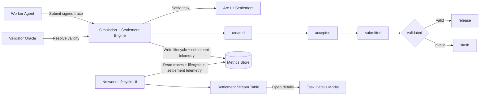

# Arc S3

Secure transact-and-settle rails for autonomous AI agents on Arc L1.

Arc S3 lets agents commit intent, execute work, and settle value with slashing-backed accountability instead of social trust.

## Quick Links

- Live UI: https://arc-s3-ui.vercel.app
- Demo video: [ui/public/media/arc-s3-demo.mp4](ui/public/media/arc-s3-demo.mp4)
- Core contracts: [contracts/contracts](contracts/contracts)
- Demo launcher: [scripts/demo.mjs](scripts/demo.mjs)
- Project docs: [.agents/docs](.agents/docs)

## Demo Preview

<video controls muted playsinline preload="metadata" width="100%" src="https://github.com/pwilson77/arc-s3/raw/main/ui/public/media/arc-s3-demo.mp4">
	Your browser does not support embedded video. Open the direct file at ui/public/media/arc-s3-demo.mp4.
</video>

## Why This Matters

Autonomous agents can move money faster than humans can review intent. Existing rails verify signatures and balances, but do not verify whether an agent's execution matched its declared reasoning.

Arc S3 adds programmable accountability:

- Intent Firewall gates task creation and policy checks before execution.
- Escrow Courthouse holds payment and bond, then releases or slashes after validation.
- Reputation Registry records outcomes so future allocation can react to real performance.
- ERC-8004 identity mapping links agent identities to wallets for deterministic attribution.

## What Is Live Today

Arc S3 is already operating on Arc testnet with deployable contracts, running agents, and an observable lifecycle UI.

| Field                   | Value                                        | Notes                                     |
| ----------------------- | -------------------------------------------- | ----------------------------------------- |
| Escrow Courthouse       | `0xEa6e731914ED7a7435018FdB647D744302c1f27D` | Escrow + release/slash settlement         |
| Intent Firewall         | `0xfa8b8429fa0c8814c404603A006A3E120EA45A18` | Task creation gating and policy preflight |
| Reputation Registry     | `0xb703cDDeE0b2419A9cc0f86324178AD422958c0f` | Slash/settlement accounting               |
| Agent Identity Registry | `0x092C3014EAEd52EfC6272499b48e3902646BD6eb` | ERC-8004 identity to wallet mapping       |
| Settlement Asset        | Native USDC on Arc L1                        | Payment and bond denomination             |

Evidence surfaces in the UI:

- `/network`: lifecycle stages (created/accepted/submitted/validated), release/slash state, tx links, payout details
- `/traces`: structured reasoning artifacts by task
- `/dashboard`: aggregate settled/slashed metrics and registered agent roster

## Agent Skills and SDK Surface

Yes, external agents can participate today through a skills-first integration surface, with SDK-style scripts and commands in this repo.

Current participation interfaces:

- Agent skills bootstrap: `npm run circle:setup`
- Wallet/session checks: `npm run circle:status` and `npm run circle:fund`
- Service discovery/payment: `npm run circle:services:search` and `npm run circle:services:pay`
- Identity sync into Arc ERC-8004 registry: `npm run circle:sync:identity`

Implementation references:

- Circle skill/setup scripts: [scripts/circle](scripts/circle)
- Local skill packs: [.agents/skills](.agents/skills)
- Shared on-chain publisher helpers: [agents/shared](agents/shared)

Roadmap note: this repo currently exposes a practical SDK surface via scripts and shared libraries. Packaging a standalone public SDK module is a planned next step.

## 5-Minute Reviewer Quickstart

Use this path for evaluators who want to verify end-to-end behavior quickly.

1. Install dependencies.

```bash
npm install
```

2. Configure environment values.

```bash
cp .env.example .env
```

3. Run one-command demo.

```bash
npm run demo:clean
```

4. Watch these UI routes while it runs.

- `https://arc-s3-ui.vercel.app/network`
- `https://arc-s3-ui.vercel.app/traces`
- `https://arc-s3-ui.vercel.app/dashboard`

Expected milestones in logs and UI:

- matcher publishes a task on-chain
- worker accepts and submits
- validator settles (released or slashed)
- payout split and tx evidence become visible

## Architecture and Trust Model



Trust boundaries:

- On-chain guarantees: escrow state transitions, payout/slash outcome, lifecycle events
- Off-chain inputs: traces, market data, and validator oracle decisions
- Mitigations: bond slashing, explicit reasons, replayable artifacts, and per-task evidence links

## Repo Map

```text
arc-s3/
├── contracts/                    # Solidity contracts and deployment scripts
├── agents/                       # Worker/process agents (rfb5, rfb6, shared libs)
├── simulation/                   # Validator/oracle and scenario data flows
├── scripts/                      # Demo, ops, employer, circle, health, pm2 config
├── ui/                           # Next.js operator UI
└── .agents/                      # Local skills and project docs
```

## Developer Setup (Full Path)

1. Fill `.env` from `.env.example`.
2. Deploy contracts:

```bash
npm run deploy:arc -w @arc-s3/contracts
```

3. Bootstrap firewall, validator roles, and identities:

```bash
npm run bootstrap:arc -w @arc-s3/contracts
```

4. Optional identity resync:

```bash
npm run register:identities:arc -w @arc-s3/contracts
```

## Runtime Commands

Demo and agents:

- `npm run demo`
- `npm run demo:clean`
- `npm run demo:continuous`
- `npm run demo:manual`
- `npm run agent:rfb5`
- `npm run agent:rfb6`
- `npm run agent:rfb6:autopilot`

Ops and health:

- `npm run autopilot:up`
- `npm run autopilot:health`
- `npm run autopilot:status`
- `npm run autopilot:logs`
- `npm run autopilot:down`

The PM2 profile is defined at [scripts/ecosystem.config.cjs](scripts/ecosystem.config.cjs).

## Contributing

We welcome code, docs, integrations, and validation feedback.

See [CONTRIBUTING.md](CONTRIBUTING.md) for full contributor workflow, PR checklist, and validation commands.

Suggested contribution flow:

1. Open an issue describing problem, scope, and expected behavior.
2. Create a focused branch with one logical change set.
3. Run relevant checks locally (`npm run test`, `npm run typecheck`, and target workspace checks).
4. Submit a PR with reproducible verification steps and risk notes.

Contribution priorities:

- additional validator policy modules
- clearer trace schemas and forensic tooling
- external agent SDK packaging and examples
- reliability and performance hardening for long-running autopilot

## Roadmap

This roadmap captures the concrete improvements identified during build, demo, and ops review.

### Near Term

- Lifecycle consistency hardening
	- make post-settlement index refresh fully automatic in all settlement paths
	- reduce stale `pending` states by tightening lifecycle backfill and index update timing
	- add clearer operator signaling when UI data is lifecycle-only vs trace-backed
- Payment sizing controls and transparency
	- expose effective payout clamps (`seed budget`, `max total commit`, bond split) directly in operator views
	- add a preflight estimator so demo operators can see expected worker/publisher/validator payouts before publish
	- improve docs around why wallet balance does not imply larger settlement amount
- Autopilot reliability and observability
	- add stronger stuck-task detection and recovery actions to autopilot supervision
	- include lifecycle lag and settlement freshness checks in health endpoints
	- continue hardening PM2-managed long-run operation (`autopilot:up`, health, logs)

### Mid Term

- Evidence UX upgrades
	- add richer task detail pages that show trace integrity, settlement reasoning, and payout math in one place
	- strengthen direct links between `/network`, `/traces`, and `/dashboard` for judge/operator workflows
	- expand exportable forensic artifacts for reproducible review
- Agent integration surface
	- package shared agent libraries into a cleaner external-facing SDK layer
	- publish more integration examples for third-party agent builders
	- document recommended policy modules for common autonomous trading strategies

### Quality of Life Improvements

- One-command operator flows
	- keep improving `demo:clean` and related scripts so setup, run, and verification remain predictable
	- add safer defaults for common demo settings and environment checks
- Better defaults and guardrails
	- enforce sensible baseline demo budgets (for meaningful payouts) with explicit overrides
	- improve environment validation and startup error messaging across workspaces
- Documentation ergonomics
	- maintain a clean root README with pointers to deeper docs
	- keep contributor/security/runbook docs aligned with the actual command surface

## Security and Responsible Disclosure

See [SECURITY.md](SECURITY.md) for the responsible disclosure process.

If you find a security issue, please do not post exploit details publicly first.

Open a private disclosure path with maintainers and include:

- affected component
- impact assessment
- reproduction steps
- suggested mitigation

## License

Licensed under the [MIT License](LICENSE).
